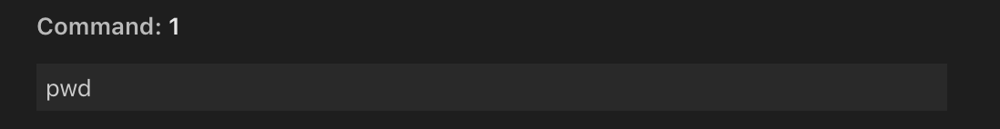
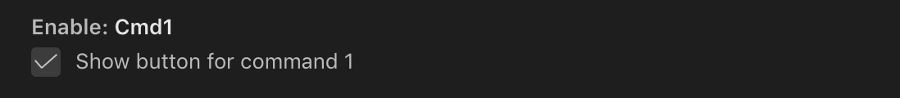
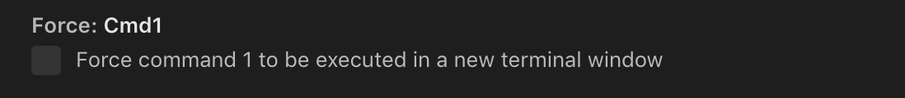

# Touch Bar Commands

This extension allows for 4 MacBook TouchBar icons (✎1-✎4) that each execute a CLI command of choice in VSCodes integrated terminal.


## Features

The extension can be customized within VSCodes settings.

### Custom commands

Type desired command



### Enable / disable buttons

Each button can be hidden when not desired.



### Force new terminal window

Each command can forced to be run in a new terminal window (disabled by default). A new terminal window will also be created if none exist.



### Accessability

The commands are also available from the `command palette` (`Cmd+Shift+P`) and kan be bound to shortcuts, like

```
  "key": "cmd+shift+1",
  "command": "touch-bar-commands.execute.cmd1"
```

to bind command 1.

## Extension Settings

This extension contributes the following settings:

* `touch-bar-commands.enable.cmdX`: enable/disable command X
* `touch-bar-commands.force.cmdX`: force command X to be executed in a new terminal window
* `touch-bar-commands.command.X`: Command X that is executed

## Known Issues

* The extension cannot dynamically edit the text of the TouchBar icon text due to VSCode limitations.

## Release Notes

### 1.0.0

Initial release
